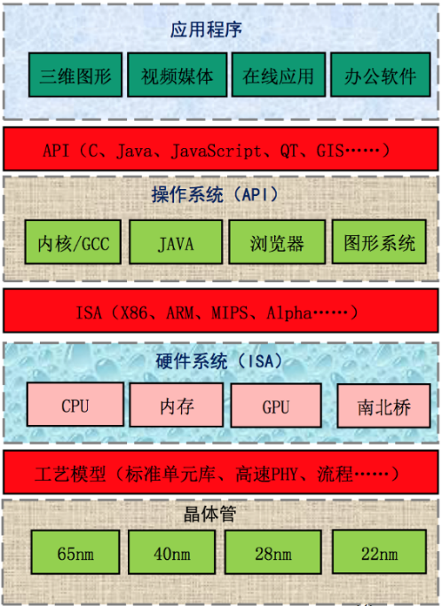

# Chapter 01 引言

> 本章介绍了计算机体系结构的研究内容, 包括:
>
> - 指令系统结构和以冯·诺依曼结构为基础的计算机组织结构, 以及微体系结构和并行体系结构;
> - 衡量计算机的主要指标, 性能, 面积, 功耗的评价和优化;
> - 计算机体系结构的发展简史, 工艺和应用的发展对体系结构的影响, 制约体系结构发展的因素;
> - 计算机体系结构设计应遵循的基本原则, 包括平衡性, 局部性, 并行性, 虚拟化等.

## 1.1 计算机体系结构的研究内容

> 参考案例: ppt 的翻页过程

### 通用计算机系统结构的层次与界面

{: style="height:320px" align=right}

四个层次:

- 应用程序
- OS
- 硬件系统
- 工艺 (晶体管)

三个界面:

- API (应用程序编程接口) 是建立生态的起点
- ABI (应用程序二进制接口) 是应用程序访问计算机硬件及操作系统服务的接口
- ISA (指令系统) 是软件兼容的关键, 是生态建设的终点

冯诺依曼结构的五个组成部分: 控制器, 运算器, 存储器, 输入设备, 输出设备

> - 记忆=存储器
> - 计算=运算器+控制器=CPU

**核心思想**: 数据和程序都存在存储器中. CPU 从内存中取指令和数据进行运算, 并且把结果也放在内存中. 概括起来就是存储程序和指令驱动执行.

> 冯诺依曼结构存储程序和指令驱动执行是计算机体系结构的基础.

## 1.2 衡量计算机的指标

主要指标: 性能, 价格, 功耗

### 性能

**性能**最本质的定义是: 完成一个任务所需要的时间 $T$ .

$$
T = \#(\text{instructions})\times \text{CPI} \times \frac{1}{f}
$$

影响各个部分的相关因素:

- 完成任务需要的指令数 ($\#(\text{instructions})$) : 算法, 编译器, 指令功能
- 每条指令需要的拍数 (CPI) : 编译器, 指令功能, 微结构设计
- 每拍需要的时间 ($\frac{1}{f}$) :微结构, 电路设计, 工艺

此外, 在一个系统中不同层次有不同的性能标准, 很难用一项单一指标刻画计算机性能的高低.

IPC 是什么? Instruction per cycle 每周期执行指令数, 它是 CPI 的倒数.

- 影响 IPC 的因素: 处理器的微结构设计 (单发射/多发射, 转移猜测策略, 存储层次设计)

### 价格

价格与成本 (结合要求) , 芯片成本等有关. 芯片成本又与制造成本, 研发成本, 生产量, 成品率等有关.

### 功耗

芯片功耗是计算机功耗的重要组成部分, 主要由晶体管产生.

对于一个由 PMOS 管和 NMOS 管组成的反相器, 功耗主要分为:

- 开关功耗:电容充放电
- 短路功耗: P 管和 N 管在开闭过程中短路
- 漏电功耗: MOS 管不能严格关闭时漏电

其中, 开关功耗和短路功耗都是动态电流功耗 (都是在电流变化过程中产生的) .

功耗的优化:

- 动态功耗优化: 升级工艺 (降低电容和电压)
- 静态功耗优化: 选择低功耗工艺

## 1.3 计算机体系结构的发展

在 2010 年之前, 计算机工业的发展主要是工艺驱动为主, 应用驱动为辅, 都是计算机工艺厂家先挖空心思发明出应用然后让大家去接受; 但在 2010 年之后, 随着计算机基础软硬件的不断成熟, 产业的主要创新从工艺转向应用. 可以预计, 未来计算机应用对体系结构的影响将超过工艺技术, 成为计算机体系结构发展的首要动力.

摩尔定律的终结:人工规律, CMOS 工艺面临物理极限.

计算机发展过程中的一个里程碑事件是桌面计算机/个人计算机的出现.

目前计算机体系结构的进一步发展面临复杂度, 主频, 功耗, 带宽等障碍.

## 1.4 体系结构设计的基本原则

体系结构设计的基本原则: 平衡性, 局部性, 并行性, 虚拟化.

### 平衡性

Amdahl 定律:

$$
ExTime_{old}\times
\left[
    (1-F_{enhanced}) + \frac{F_{enhanced}}{SpeedUp_{enhanced}}
     \right]
=ExTime_{new},
$$

$$
SpeedUp_{overall}=\frac{ExTime_{old}}{ExTime_{new}},
$$

以并行化的加速比计算为例: $s_p=\frac{1}{(1-a)+a/n}$ , 其中 $a$ 为并行部分占所有工作的比例.

### 局部性

- 事件局部性: 在结构平衡之后, 重点改变最频繁发生事件的执行效率
- 访存局部性: 时间局部性, 空间局部性

### 并行性

- 指令级并行:
  - 时间并行: 流水线
  - 空间角度: 超标量 (or say 多发射)
- 数据级并行: SIMD (单指令多数据流) 向量结构
- 任务级并行: 多核/多线程处理器, 并行粒度较大

### 虚拟化

设计打分从高到低:

- 虚存: 内存
- 多线程与虚拟机: CPU
- 流水线和多发射结构: CPU (\*)
- cache: 虚拟了像内存一样大但访问较快的一块空间
- cache 一致性协议: 对分立的物理存储器虚拟了统一编址的空间
